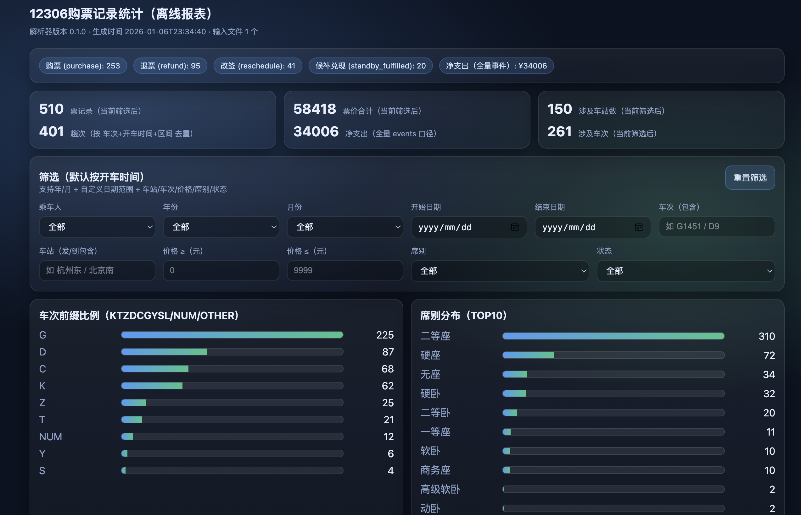

# 12306 购票记录统计工具

解析 12306 通知邮件导出的 txt 文件，生成结构化 JSON 数据和可视化 HTML 报表。



# 特别感谢

- [**车票票** APP](https://www.chepiaopiao.cn/)
    - app上有更丰富的样式和总结
- 邮箱自动提取参考：[飞书文档](https://thedafeige.feishu.cn/docx/XW2td4j1xoGU1hxTs9vct0Crn3b)


## 功能特性

- 自动解析购票、退票、改签、候补兑现等多种票务事件
- 生成单文件 HTML 报表，支持离线查看
- 多维度筛选：年份、月份、时间范围、车次、车站、价格、席别、状态、乘车人
- 丰富统计：TOP10 车站/车次/区间、车次类型比例、席别分布、时间趋势
- 分文件导出：为每个来源 txt 单独生成一份数据，方便分别统计

## 环境要求

Python 3.7+（仅使用 Python 标准库，无需安装第三方依赖）

## 使用方法

### 1. 准备数据文件

将 12306 通知邮件导出（上文飞书文档）的 txt 文件放入 `data/` 目录。

### 2. 运行解析器

```bash
python3 scripts/parse_12306.py --input-dir data --output out
```

**命令行参数**：

- `--input-dir <目录>`：指定包含 txt 文件的目录（自动扫描所有 `*.txt`）
- `--inputs <文件1> <文件2> ...`：显式指定多个 txt 文件路径
- `--output <目录>`：指定输出目录（默认：`out`）
- `--no-report`：不生成 HTML 报表（仅生成 JSON 数据）

### 3. 查看结果

解析完成后，会在输出目录生成：

**合并数据**：
- `out/events.jsonl` - 事件级数据
- `out/tickets.json` - 票面级数据
- `out/metadata.json` - 元信息
- `out/report.html` - 可视化报表（双击打开）

**分文件数据**：
- `out/by_file/<文件名>/` - 每个 txt 文件单独一份数据（含独立报表）

## 报表功能

打开 `report.html` 后可以：

- **统计总览**：事件次数、净支出
- **TOP10**：车站、车次、区间排行榜
- **比例分析**：车次类型分布、席别分布
- **时间趋势**：按月统计趟数和金额
- **筛选查询**：按年份/月份、时间范围、车次、车站、价格、席别、状态、乘车人筛选
- **明细表格**：可展开查看订单号、事件类型、办理日期等详情

## 数据格式

- **events.jsonl**：每行一个 JSON 对象，代表一封票务邮件（含 tickets 数组）
- **tickets.json**：JSON 数组，每张票一条记录（已展平，便于统计）
- **metadata.json**：解析器版本、输入文件列表、统计摘要

## 状态说明

- **active（未退改）**：正常购票，未被退票或改签
- **refunded（已退票）**：购票后被退票
- **rescheduled（已改签）**：购票后被改签

默认统计口径为 **all_events**（统计所有发生过的事件），即使后来退票/改签，原始购票记录也会保留并标注状态。

## 注意事项

1. **数据隐私**：`data/` 目录下的 txt 文件包含个人信息，已配置 `.gitignore` 防止误上传
2. **无座处理**：所有形如 "N车无座" 的席别会被统一归类为 "无座"
3. **候补兑现**：候补购票成功兑现的事件会被视为一次购票，计入购票总量
4. **时间维度**：报表中的年份/月份筛选默认按**开车时间**，而非购票时间

## 未来新增数据

当有新的 txt 文件时：

1. 将新文件放入 `data/` 目录
2. 重新运行解析器：`python3 scripts/parse_12306.py --input-dir data --output out`
3. 所有数据会自动合并，并生成新的报表

